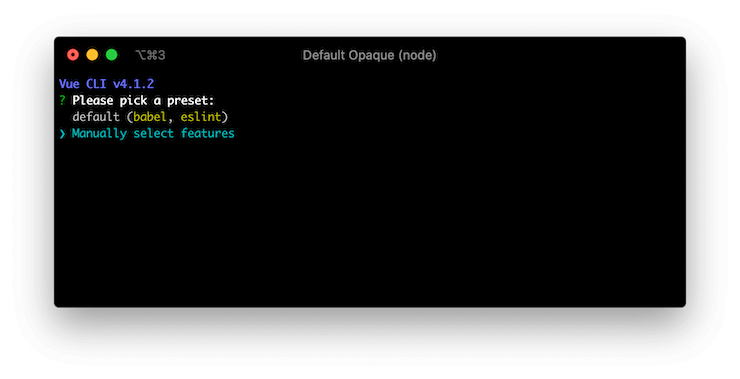
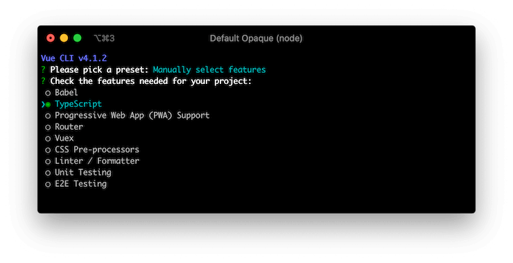
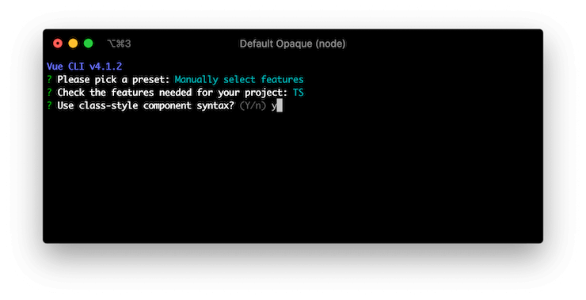

# Монтаж

## Настройка Vue CLI

Вы можете легко настроить свой проект Vue Class Component, используя [Vue CLI](https://cli.vuejs.org/). Выполните следующую команду, чтобы создать новый проект:

```sh
$ vue create hello-world
```

Вас спросят, используется ли предустановка. Выберите «Выбрать функции вручную»:



Отметьте функцию TypeScript, чтобы использовать компонент класса Vue. Вы можете добавить другие функции, если вам нужно:



Нажмите `y`, чтобы задать вопрос `Use class-style component syntax?`:



Вы можете ответить на оставшиеся вопросы по своему усмотрению. После завершения этого процесса установки Vue CLI создает новый каталог проекта с установленным компонентом класса Vue.

## Ручная настройка

Если вы предпочитаете ручную настройку, установите ее через npm и настройте инструмент сборки.

### npm

Вы можете установить компонент класса Vue с помощью команды `npm`. Не забудьте также установить базовую библиотеку Vue, поскольку от нее зависит компонент класса Vue:

```sh
$ npm install --save vue vue-class-component
```

Вы можете использовать команду `yarn`, если хотите:

```sh
$ yarn add --save vue vue-class-component
```

### Настройка сборки

Чтобы использовать Vue Class Component, вам необходимо настроить [TypeScript](https://www.typescriptlang.org/) или [Babel](https://babeljs.io/) в своем проекте, поскольку он основан на [ECMAScript этап 1 декораторы](https://github.com/wycats/javascript-decorators/blob/master/README.md), который необходим для транспиляции при работе в браузерах.

::: предупреждение
Он еще не поддерживает декораторы этапа 2, поскольку транспилятор TypeScript по-прежнему поддерживает только старые спецификации декораторов.
:::

#### TypeScript

Создайте `tsconfig.json` в корне вашего проекта и укажите опцию `experimentalDecorators`, чтобы он транслировал синтаксис декоратора:

```json
{
  "compilerOptions": {
    "target": "es5",
    "module": "es2015",
    "moduleResolution": "node",
    "strict": true,
    "experimentalDecorators": true
  }
}
```

#### Babel

Установить `@babel/plugin-proposal-decorators` и `@babel/plugin-proposal-class-properties`:

```sh
$ npm install --save-dev @babel/plugin-proposal-decorators @babel/plugin-proposal-class-properties
```

Затем настройте `.babelrc` в корне вашего проекта:

```json
{
  "plugins": [
    ["@babel/proposal-decorators", { "legacy": true }],
    ["@babel/proposal-class-properties", { "loose": true }]
  ]
}
```

Обратите внимание, что необходимы опции `legacy` и `loose`, поскольку компонент класса Vue пока поддерживает только спецификацию декоратора стадии 1 (устаревшую).

## CDN

[unpkg.com](https://unpkg.com/) предоставляет ссылки CDN на основе npm. Вы можете выбрать конкретную версию Vue Class Component, заменив `@latest` часть в url (например `https://unpkg.com/vue-class-component@7.2.2/dist/vue-class-component.js` используя версию 7.2.2).

```html
<!-- Сборка UMD -->
<script src="https://unpkg.com/vue-class-component@latest/dist/vue-class-component.js"></script>

<!-- UMD минифицированная сборка -->
<script src="https://unpkg.com/vue-class-component@latest/dist/vue-class-component.min.js"></script>

<!-- ES Сборка модуля -->
<script src="https://unpkg.com/vue-class-component@latest/dist/vue-class-component.esm.browser.js"></script>

<!-- ES Минифицированная сборка модуля -->
<script src="https://unpkg.com/vue-class-component@latest/dist/vue-class-component.esm.browser.min.js"></script>
```

## Различные сборки

Компонент Vue Class предоставляется в виде разных сборок для разных сред и применений.

- **For development**
  - `vue-class-component.js` (UMD)
  - `vue-class-component.common.js` (CommonJS)
  - `vue-class-component.esm.js` (ES Module for bundlers)
  - `vue-class-component.esm.browser.js` (ES Module for browsers)
- **For production (minified)**
  - `vue-class-component.min.js` (UMD)
  - `vue-class-component.esm.browser.min.js` (ES Module for browsers)
